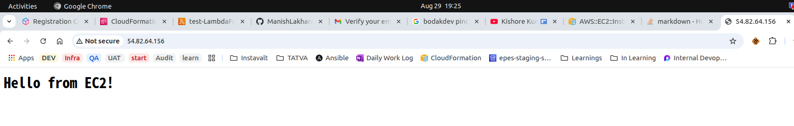
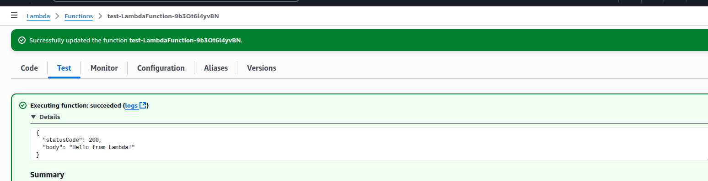

# AWS DevOps CI/CD Starter Project

## Deployment Steps
1. Login to Your AWS Account.
2. Switch to N.Verginia Region ( us-east-1 )
3. Get Pre-requisites out of the way
    * Get Key Pair from aws console, or docs :: AMI ami-00ca32bbc84273381
    * Create KeyPair: name = Manish
    * InstanceType: t3.micro ( N.Verginia Region)
4. Deploy All-in-one-main.yml template at cloudformation console.
    * Use Pre-requisite fetched to fill in parametes
5. Varify deployment by visiting Outputed ec2 ip address. 
    * 
6. Visit lambda console and run test to get 200 - 'Hello from Lambda!'
    * 
----
### Up to this point we have deployed infrastructure
Pipeline setup you will find at word document.